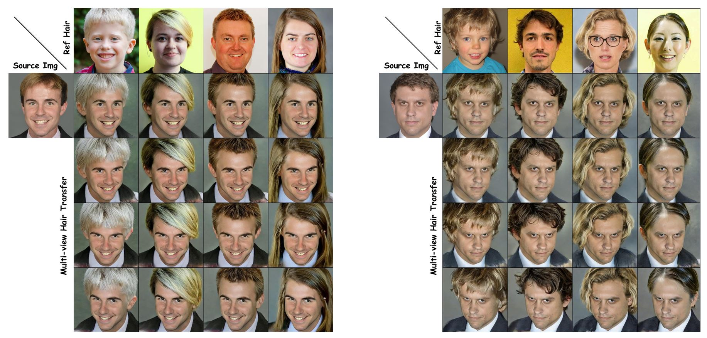

# StableHair v2 (Accepted by TVCG 2026)
**Stable-Hair v2: Real-World Hair Transfer via Multiple-View Diffusion Model**  
Kuiyuan Sun*, [Yuxuan Zhang*](https://xiaojiu-z.github.io/YuxuanZhang.github.io/), [Jichao Zhang*](https://zhangqianhui.github.io/), [Jiaming Liu](https://scholar.google.com/citations?user=SmL7oMQAAAAJ&hl=en), 
 [Wei Wang](https://weiwangtrento.github.io/), [Nicu Sebe](http://disi.unitn.it/~sebe/), [Yao Zhao](https://scholar.google.com/citations?user=474TbQYAAAAJ&hl=en&oi=ao)<br>
*Equal Contribution <br>
Beijing Jiaotong University, Shanghai Jiaotong University, Ocean University of China, Tiamat AI, University of Trento <br>
[Arxiv](https://arxiv.org/abs/2507.07591), [Demo (Chinese) by @ouclxy (still under development) ](https://huggingface.co/spaces/ouclxy/stablehairv2_demo)<br>

Bald     |  Reference | Multiple View | Original Video
  
Bald     |  Reference | Multiple View | Original Video


## Environments

```
conda create -n stablehairv2 python=3.10
```
```
pip install -r requirements.txt
```

## Results

 

## Pretrained Model
| Name                       |   Model   | 
|----------------------------|:---------:|
| motion_module-41400000.pth | [:link:](https://drive.google.com/file/d/1AZMhui9jNRF3Z0N72VDPOwDd0JafLQ3B/view?usp=drive_link) | 
| pytorch_model_1.bin        |  [:link:](https://drive.google.com/file/d/1FwKPZI8lvdlZqu8R1aJ-QbE55kxHPHjU/view?usp=drive_link) | 
| pytorch_model_2.bin        |  [:link:](https://drive.google.com/file/d/1h3dXlo8lhZN3ee5aN0shZmpLfn5itVou/view?usp=drive_link) | 
| pytorch_model_3.bin        |  [:link:](https://drive.google.com/file/d/1jARfXaU6wiur85Vm1JxZ_xye0FfrUiqb/view?usp=drive_link) | 
| pytorch_model.bin          |  [:link:](https://drive.google.com/file/d/1zXXf13pV5IOn2vrV6DGI9hliEFvuPrYf/view?usp=drive_link) |

### Multiple View Hair Transfer

Please use ``gdown''' to download the pretrained model and save it in your model_path
```

python test_stablehairv2.py --pretrained_model_name_or_path "stable-diffusion-v1-5/stable-diffusion-v1-5" \
       --image_encoder "openai/clip-vit-large-patch14" --output_dir [Your_output_dir]  \
       --num_validation_images 1 --validation_ids ./test_imgs/bald.jpg \
       --validation_hairs ./test_imgs/ref1.jpg --model_path [Your_model_path]
```


# Our V1 version

StableHair v2 is an improved version of [StableHair](https://github.com/Xiaojiu-z/Stable-Hair) (AAAI 2025)